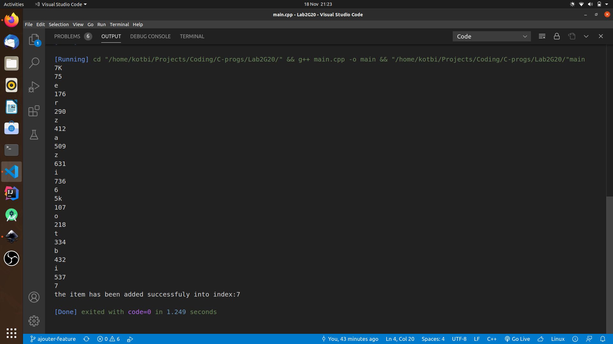

# Algorithme de Hashage 

## Table de Hashage
Implémentation un dictionnaire basé sur une table de Hachage et le chaînage pour résolution des collisions.

### Les fonctions developpées
+   void ajouterItem(string nom, string tel);
+   void afficherItem();
+   int  nombreItems(int index);
+   void afficherItemsDansIndex(int index);
+   void chercherItem(string nom);
+   void supprimerItem(string nom);

## Execution
